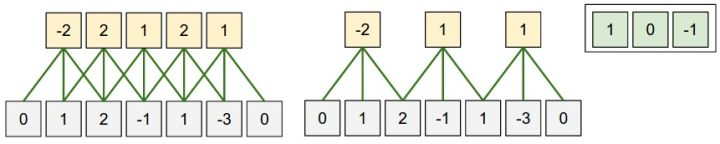

Covolution Neuro Network
------------------------------------------

卷积运算，源于信号处理。


## 卷积
#### 感受野



输出尺寸：$\frac{W-F+2P}{S} + 1$

- F: fiter, 卷积核/滤波器/感受野的尺寸，常用3x3, 5x5
- P: padding, 零填充的数量. SAME(输出与输入保持一直 F-1/2)，VALID(不填充，输出尺寸减少F/S)
- S: stride, 步长

#### code

```python
# forward
def conv_forward_naive(x, w, b, conv_param):
    """
    A naive implementation of the forward pass for a convolutional layer.

    The input consists of N data points, each with C channels, height H and
    width W. We convolve each input with F different filters, where each filter
    spans all C channels and has height HH and width WW.

    Input:
    - x: Input data of shape (N, C, H, W)
    - w: Filter weights of shape (F, C, HH, WW)
    - b: Biases, of shape (F,)
    - conv_param: A dictionary with the following keys:
      - 'stride': The number of pixels between adjacent receptive fields in the
        horizontal and vertical directions.
      - 'pad': The number of pixels that will be used to zero-pad the input. 
        

    During padding, 'pad' zeros should be placed symmetrically (i.e equally on both sides)
    along the height and width axes of the input. Be careful not to modfiy the original
    input x directly.

    Returns a tuple of:
    - out: Output data, of shape (N, F, H', W') where H' and W' are given by
      H' = 1 + (H + 2 * pad - HH) / stride
      W' = 1 + (W + 2 * pad - WW) / stride
    - cache: (x, w, b, conv_param)
    """
    N, C, H, W = x.shape
    F, _, HH, WW = w.shape
    stride, pad = conv_param['stride'], conv_param['pad']
    H_out = 1 + (H + 2 * pad - HH) // stride  
    W_out = 1 + (W + 2 * pad - WW) // stride
    out = np.zeros((N, F, H_out, W_out))

    x_pad = np.pad(x, ((0,), (0,), (pad,), (pad,)), mode='constant', constant_values=0)
    
    # out: (N, F, H', W')
    # N个输入格式一致，直接在矩阵中操作
    # 遍历输出高度(H')和宽度(W')
    for h_out in range(H_out):
        for w_out in range(W_out):
            # 获得当前卷积核对应的输入块（HH,WW）
            x_pad_block = x_pad[:, :, h_out*stride:h_out*stride+HH, w_out*stride:w_out*stride+WW]
            # 计算每个卷积核（滤波器 f）得到的输出，对应点（h_out, w_out)
            for f in range(F):
                out[:, f, h_out, w_out] = np.sum(x_pad_block * w[f, :, :, :], axis=(1,2,3)) + b[f]

    cache = (x, w, b, conv_param)
    return out, cache

# backward
def conv_backward_naive(dout, cache):
    """
    A naive implementation of the backward pass for a convolutional layer.

    Inputs:
    - dout: Upstream derivatives.
    - cache: A tuple of (x, w, b, conv_param) as in conv_forward_naive

    Returns a tuple of:
    - dx: Gradient with respect to x
    - dw: Gradient with respect to w
    - db: Gradient with respect to b
    """
    x, w, b, conv_param = cache
    N, C, H, W = x.shape
    F, _, HH, WW = w.shape
    _, _, H_out, W_out = dout.shape
    stride, pad = conv_param['stride'], conv_param['pad']
	
    # 0填充　padding
    x_pad = np.pad(x, ((0,), (0,), (pad,), (pad,)), mode='constant', constant_values=0)

    dx_pad = np.zeros_like(x_pad)
    dw = np.zeros_like(w)
    db = np.zeros_like(b)

    # 遍历数据输入n
    for n in range(N):
        # 遍历 filter f
        for f in range(F):
            # db (N,F)
            db[f] += np.sum(dout[n, f])
            # 遍历输出高度和宽度
            for h_out in range(H_out):
                for w_out in range(W_out):
                    # 获得当前卷积核f对应的输入块（HH,WW）
                    x_pad_block = x_pad[n, :, h_out*stride:h_out*stride+HH, w_out*stride:w_out*stride+WW]
                    # dw (F,)
                    dw[f, :, :, :] += x_pad_block * dout[n, f, h_out, w_out]
                    dx_pad[n, :, h_out*stride:h_out*stride+HH, w_out*stride:w_out*stride+WW] += \
                        w[f, :, :, :] * dout[n, f, h_out, w_out]

    dx = dx_pad[:, :, pad:pad+H, pad:pad+W]

    return dx, dw, db


```


## 池化

最大池化

