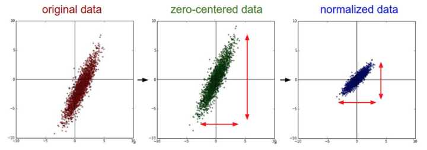
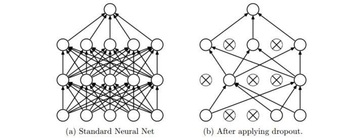

深度学习和神经网络(CS231n Note)
---------------------------

## 1. 神经元模型与数学模型（Neuron Network Unit）


神经元（Neuron）通过树突（Dendrites）接收输入信号，沿着轴突（axon）产生输出信号。轴突在末端分叉，通过突触和其他神经元的树突相连。

输入信号（$x_0,x_1,...,x_n$）传递到其他神经元的树突，基于突触的突触强度相乘（$w_0x_0,w_1x_1,...,w_nx_n$）。突触的强度（权重$w$）可以控制一个神经元对另一个神经元的影响强度，使其兴奋（正权重）或抑制（负权重）。输出信号如果高于阈值，则神经元激活（对应于激活函数$f(\sum_{i}w_ix_i+b)$）。

1. 1 多层感知机

   输入层  -> 隐藏层 -> 输出层

   

## 2. 常用激活函数

|         | 函数                                    | 值域          | 导数 | 备注 |
| ------- | --------------------------------------- | ------------- | ---- | ---- |
| sigmoid | $ \sigma(x)=\frac{1}{1+e^{-x}} $        | [0,1]         | [0, 0.25]   | 分类概率 |
| tanh    | $tanh(x)=\frac{e^x-e^{-x}}{e^x+e^{-x}}$ | [-1,1]        | [0, 1]     |      |
| relu    | $relu(x)=max(0, x)$                     | $[0,+\infty]$ |$f'_x=\begin{cases}0, x<0\\1, x>0\\undefinded, x=0\end{cases}$||
#### sigmoid

优点：

1. 分类概率

缺点

1. 梯度容易饱和而丢失，激活函数在接近0,1时会饱和，如果权重过大，很容易失去梯度
2. 函数不经过0，不以0点对称，在中间点0.5附近的的梯度较小（0.25），梯度总体较小，不利于梯度传播
3. 激活值永远全为正（负），下一神经元的输入总是正数（负数），则反向传播过程中梯度更新呈z字型
4. exp指数函数计算复杂


#### tanh  

$tanh(x)=2\sigma(2x)-1$

优点：

1. 范围更大 [0, 1]
2. 以 0 为中心点
3. 中间部分梯度更大，有利于梯度传播

缺点：

1. 梯度饱和而丢失的情况仍然存在

   ### relu

优点

1. 收敛速度更快（e.g. 6x than sigmoid/tanh)
2. 计算简单
3. 梯度不会饱和

缺点

1. 可能导致部分神经元“死掉”，永远不会被激活。输出值始终为负，激活值为0，梯度为0，反向传播不更新此神经元的梯度。降低学习率来降低神经元“死掉”的概率。


#### Leaky Relu

解决Relu死亡的问题

$$f(x)=\begin{cases}x, x>0\\\alpha x, x<0\end{cases}​$$, $\alpha=0.01​$

#### ELU

$$f(x)=\begin{cases} x, x>0\\ \alpha(e^x-1), x\leq0\end{cases}$$


#### Maxout

$$max(w_{1}^Tx+b_1, w_{2}^Tx+b_2)$$

## 3. 数据预处理

### 归一化 Normalization

```
# 数据归一化
X = X / np.std(X, axis=0)
# 维度归一化
X = X / np.std(X, axis=1)
```



 ### PCA 白化（很少在深度学习中使用）

PCA/白化。**左边**是二维的原始数据。**中间**：经过PCA操作的数据。可以看出数据首先是零中心的，然后变换到了数据协方差矩阵的基准轴上。这样就对数据进行了解相关（协方差矩阵变成对角阵）。**右边**：每个维度都被特征值调整数值范围，将数据协方差矩阵变为单位矩阵。从几何上看，就是对数据在各个方向上拉伸压缩，使之变成服从高斯分布的一个数据点分布。


### CIFAR 数据PCA

nx3072 维向量（图片32x32x3）,协方差矩阵：3072x3072


1: 49张图片。2: 3072个特征值向量中的前144个。3: 49张PCA降维的图片（U.transpose()[:144,:]）。4: 白化后的数据。144个维度的方差都压缩到相同的数值范围（U.transpose()[:144,:]）。现在较低的频率（代表了大多数方差）可以忽略不计了，较高的频率（代表相对少的方差）就被夸大了。

## 4. 权重初始化

#### 小随机数初始化

基于均值为0，标准差为1的高斯分布

```
W = 0.01 * np.random.randn(N, D)
```

#### 使用$\frac{1}{\sqrt{n}} $校准方差

数据量增大，随机初始化的神经元输出数据分布的方差也增大

```python
W = np.random.randn(N, D) / np.sqrt(N)
```

#### He Normal

网络中神经元的方差应该是$\frac{2}{n}$

当前的推荐是使用ReLU激活函数，并且使用**w = np.random.randn(n) \* sqrt(2.0/n)**来进行权重初始化

```python
W = np.random.randn(n) * sqrt(2.0/n)
```

#### 偏置初始化 biases

```
b = np.zeros(n,)
```

## 正则化

#### L1 正则


#### L2正则


## Dropout



1.  Bagging 集成模型，随机抽样神经网络的子集。多个共享参数的子网络组成。
2. 增强单个神经元独立学习特征的能力，减少神经元之间的依赖
3. 加性噪声

```
""" 
反向随机失活: 推荐实现方式.
在训练的时候drop和调整数值范围，测试时不做任何事.
"""

p = 0.5 # 激活神经元的概率. p值更高 = 随机失活更弱

def train_step(X):
  # 3层neural network的前向传播
  H1 = np.maximum(0, np.dot(W1, X) + b1)
  #                  [0, 1]随机分布 P(rand(x)) < p = p
  mask1 = (np.random.rand(*H1.shape) < p) / p # 第一个随机失活掩码. 注意/p!
  H1 *= mask1 # drop!
  H2 = np.maximum(0, np.dot(W2, H1) + b2)
  mask2 = (np.random.rand(*H2.shape) < p) / p # 第二个随机失活掩码. 注意/p!
  H2 *= mask2 # drop!
  out = np.dot(W3, H2) + b3

  # 反向传播:计算梯度... (略)
  # 进行参数更新... (略)

def predict(X):
  # 前向传播时模型集成
  H1 = np.maximum(0, np.dot(W1, X) + b1) # 不用数值范围调整了
  H2 = np.maximum(0, np.dot(W2, H1) + b2)
  out = np.dot(W3, H2) + b3
```

## Batch Normalization

批量归一化可以理解为在网络的每一层之前都做预处理，减少之前网络权重对数据的影响，保持每一层输出数据的分布（均值和标准差），使输出适应下一层网络，也使得每一层数据相对独立。


### Internal Co-variate Shift

Reference: [Batch Normalization原理与实战](<https://zhuanlan.zhihu.com/p/34879333>)

随着训练的进行，网络中的参数也随着梯度下降在不停更新。一方面，当底层网络中参数发生微弱变化时，由于每一层中的线性变换与非线性激活映射，这些微弱变化随着网络层数的加深而被放大（类似蝴蝶效应）；另一方面，参数的变化导致每一层的输入分布会发生改变，进而下一层的网络需要不停地去适应这些分布变化，使得我们的模型训练变得困难。上述这一现象叫做Internal Covariate Shift。

原作定义：在深层网络训练的过程中，由于网络中参数变化而引起内部结点数据分布发生变化的这一过程被称作Internal Covariate Shift。

随着梯度下降的进行，每一层的参数$W^{[l]}$与$b^{[l]}$都会被更新，那么$Z^{[l]}$的分布也就发生了改变，进而$A^{[l]}$也同样出现分布的改变。而$A^{[l]}$作为第 $l+1$ 层的输入，意味着 $l+1$ 层需要去不停适应这种数据分布的变化，这一过程叫做 Interval Covariate Shift.

#### 带来的问题：

1. 上层网络需要不停调整来适应输入数据分布的变化，导致网络学习速度的降低
2. 网络的训练过程容易陷入梯度饱和区，减缓网络收敛速度（sigmoid, tanh）。 $Z^{[l]}$会逐渐更新并变大，陷入梯度饱和区。可以通过Normalization 使得激活函数输入分布在一个稳定的空间来避免他们陷入梯度饱和区。

#### 如何减缓 Interval Covariate Shift

1. 白化。成本高，改变了网络每一层分布导致数据表达的特征信息丢失

   - 使得输入特征分布具有相同的均值与方差。其中PCA白化保证了所有特征分布均值为0，方差为1
   - 去除特征之间的相关性

2. Batch Normalization   简化加改进版的白化

   - 简化。让每个特征都有均值为0，方差为1的分布就OK。
   - 白化操作减弱了网络中每一层输入数据表达能力，那我就再加个线性变换操作，让这些数据再能够尽可能恢复本身的表达能力就好了。

   

BN 引入了两个可学习的参数 $\gamma$ 和 $\beta$.。这两个参数的引入是为了恢复数据本身的表达能力，对规范后的数据进行线性变换，即 $y_i = \gamma x_i + \beta_i$。 特别的，当 $\gamma^2=\sigma ^2$（方差）, $\beta = \mu$ （均值）时，可以实现等价变换并且保留原始输入特征的分布信息。

#### Batch Normalization 的作用

1. 使得网络中每层输入数据的分布相对稳定，加快模型学习速度

2. 使得模型对参数不那么敏感，减小初始化参数对模型学习的影响，可以选择更大的初始化值，学习率选择范围更大

   当学习率设置太高时，会使得参数更新步伐过大，容易出现震荡和不收敛。但是使用BN的网络将不会受到参数数值大小的影响。BN抑制了参数微小变化随着网络层数加深被放大的问题，使得网络对参数大小的适应能力更强

3. 缓解梯度消失的问题

4. 正则化效果，mini-batch 的mean/variance 作为总体样本的抽样估计，引入随机噪声

**BN通过将每一层网络的输入进行normalization，保证输入分布的均值与方差固定在一定范围内，减少了网络中的Internal Covariate Shift问题，并在一定程度上缓解了梯度消失，加速了模型收敛；并且BN使得网络对参数、激活函数更加具有鲁棒性，降低了神经网络模型训练和调参的复杂度；最后BN训练过程中由于使用mini-batch的mean/variance作为总体样本统计量估计，引入了随机噪声，在一定程度上对模型起到了正则化的效果。**

#### backpropagation

Reference: [Understanding the backward pass through Batch Normalization Layer](<https://kratzert.github.io/2016/02/12/understanding-the-gradient-flow-through-the-batch-normalization-layer.html>)