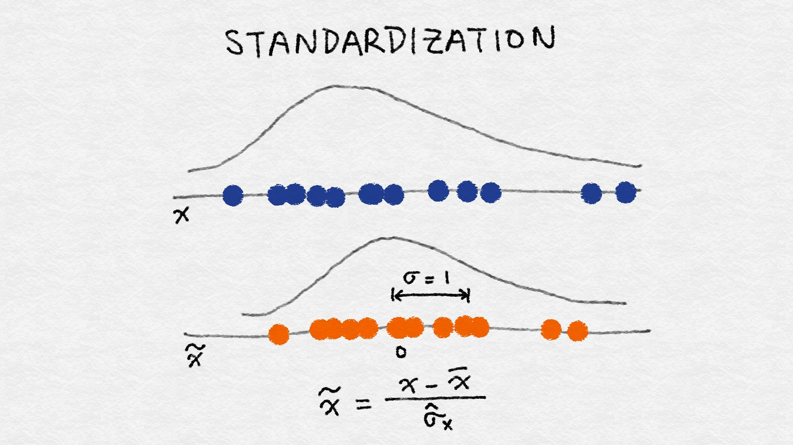

Feature Engineering
-------------------------------

## Charpter 2 简单数字的奇特技巧

### 二值化　０，１

### 量化或装箱　　

```python
>>> small_counts
array([30, 64, 49, 26, 69, 23, 56, 7, 69, 67, 87, 14, 67, 33, 88, 77, 75, 47, 44, 93])
### Map to evenly spaced bins 0-9 by division
>>> np.floor_divide(small_counts, 10)
array([3, 6, 4, 2, 6, 2, 5, 0, 6, 6, 8, 1, 6, 3, 8, 7, 7, 4, 4, 9], dtype=int32)

>>> large_counts = [296, 8286, 64011, 80, 3, 725, 867, 2215, 7689, 11495, 91897, 44, 28, 7971, 926, 122, 22222]
### Map to exponential-width bins via the log function
>>> np.floor(np.log10(large_counts))
array([ 2., 3., 4., 1., 0., 2., 2., 3., 3., 4., 4., 1., 1., 3., 2., 2., 4.])
```

### 分位数装箱

```python
### Map the counts to quartiles
>>> pd.qcut(large_counts, 4, labels=False)
array([1, 2, 3, 0, 0, 1, 1, 2, 2, 3, 3, 0, 0, 2, 1, 0, 3], dtype=int64)
>>> large_counts_series.quantile([0.25, 0.5, 0.75])
0.25 122.0
0.50 926.0
0.75 8286.0
dtype: float64
```

### 对数转换

线性回归模型的训练过程假定预测误差分布得像高斯，对数变换，这是一种功率变换，将变量的分布接近高斯。

对数变换是处理具有重尾分布的正数的有力工具。（重尾分布在尾部范围内的概率比高斯分布的概率大）


使用$R^2$评分来评估，好的模型有较高的 R 方分数。一个完美的模型得到最高分1， 一个坏的模型可以得到一个任意低的负评分。

```python
scores_log = cross_val_score(m_log, biz_df[['log_review_count']], biz_df['stars'], cv=10)
scores_log.mean()  # R^2
```


对数变换将较大的离群值压缩到一个更小的范围内

### Box-Cox transformation

???

概率图(probplot)是一种直观地比较数据分布与理论分布的简单方法。

### 特征缩放(Scaling)或归一化(Normalization)

#### minmaxscaler　

$x'=\frac{x-min}{max-min}$

Min-max缩放压缩（或拉伸）所有特征值到[0, 1 ]的范围内


#### Standardization

$x'=\frac{x-\overline{x}}{\sigma}$

缩放后的特征的平均值为0, 方差为1。如果原始特征具有高斯分布, 则缩放特征为标准高斯



最小最大缩放和标准化都从原始特征值中减去一个数量，将稀疏特征的向量转换为一个稠密的向量。

### L2 Normalization

$x'=\frac{x}{\sqrt{\sum_{j} x_j^2}}$


