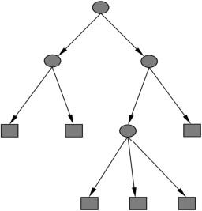
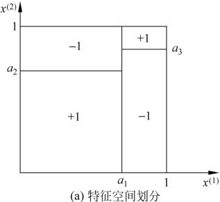
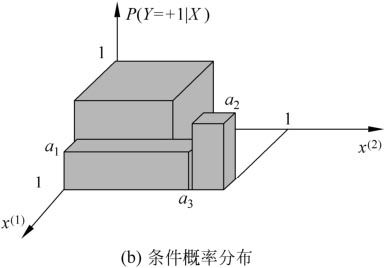
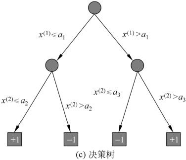

## Part 4. 决策树

--------

Decision Tree　树形结构，根据损失函数最小化原则建立决策树模型

if-then规则集合，每一条路径构建一条规则

- 内部节点：特征/属性，规则的条件

- 叶节点：　类，规则的结论

条件概率分布

将特征空间划分为互不相交的单元（cell）或区域（region）

$P(Y=+1|X=c)>0.5$, 单元cell　属于正类

